# Taller Arquitecturas de Servidores de Aplicaciones, Meta Protocolos de Objetos, Patrón IOC y reflexión

Fecha: Septiembre 13 del 2021

Tercer Laboratorio de Arquitecturas Empresariales (AREP).

## Descripción (1H)

Para este taller los estudiantes deberán construir un servidor Web (tipo Apache) en Java. El servidor debe ser capaz de entregar páginas html e imágenes tipo PNG. Igualmente el servidor debe proveer un framework IoC para la construcción de aplicaciones web a partir de POJOS. Usando el servidor se debe construir una aplicación Web de ejemplo y desplegarlo en Heroku. El servidor debe atender múltiples solicitudes no concurrentes.

Para este taller desarrolle un prototipo mínimo que demuestre capacidades reflexivas de JAVA y permita por lo menos cargar un bean (POJO) y derivar una aplicación Web a partir de él. Debe entregar su trabajo al final del laboratorio.

**SUGERENCIAS**

1. Cargue el POJO desde la línea de comandos, de manera similar al framework de TEST. Es decir pásela como parámetro cuando invoke el framework. 

   Ejemplo de invocación:

   `java -cp target/classes co.edu.escuelaing.reflexionlab.MicroSpringBoot co.edu.escuelaing.reflexionlab.FirstWebService`

2. Atienda la anotación `@ResuestMapping` publicando el servicio en la URI indicada, limítelo a tipos de retorno String.
   
   Ejemplo:

    ~~~
    public class HelloController {

	    @RequestMapping("/")
	    public String index() {
		    return "Greetings from Spring Boot!";
	    }
    }
    ~~~

## Contenido

  - [Prerrequisitos](#prerrequisitos)
  - [Compilar](#compilar)
  - [Ejecutar](#ejecutar-de-forma-local)
  - [Uso](#uso)
  - [Diagramas](#diagramas)
  - [Resultados de las Pruebas](#resultados-de-las-pruebas)
  - [Generación de Javadoc](#generación-de-javadoc)
  - [Documentación en PDF realizada en LATEX](#documentación-en-PDF-realizada-en-LATEX)
  - [Autor](#autor)
  - [Licencia](#licencia)

## Prerrequisitos

Se utilizara **Maven** como una herramienta para la construcción y gestión del proyecto, el código fue desarrollado con lenguaje de programación **Java**; por lo tanto es necesario para la ejecución tener las dos herramientas en las versiones correctas.

  - Java versión 8 o superior
  
  - Maven versión 3.5 o superior 
    
## Compilar

Después clonar el proyecto se debe utilizar el comando `mvn package` para generar el ejecutable .jar con los .class compilados.

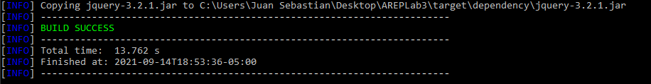

Después de realizar la ejecución de las dos formas (.jar o .class), se accede de forma local dirigiéndose a la dirección http://localhost:4444.

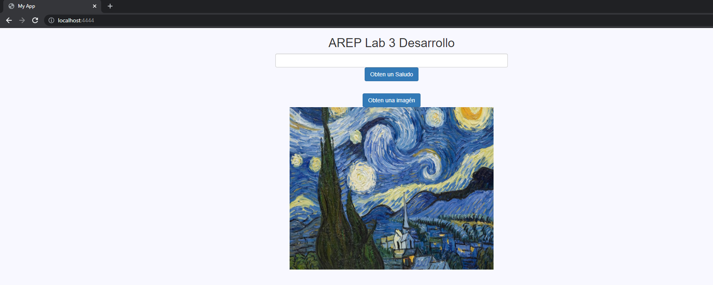

## Uso

Para hacer uso de la aplicación se debe realizar lo siguiente:

1.  Abrir la aplicación de forma local o remota y escribir números separados por coma.

    URL Aplicación ejecutada de forma Local: http://localhost:4444

    URL Aplicación alojada de forma Remota con Heroku: https://lab3arepjuanmunoz.herokuapp.com/
    
    Esta pagina HTML contiene una imagen PNG y utiliza un archivo JS.
    
2.  La aplicación presenta el feature hacer click en el botón `Obtener Imagen`, el cual hara que la imagen desaparezca.

    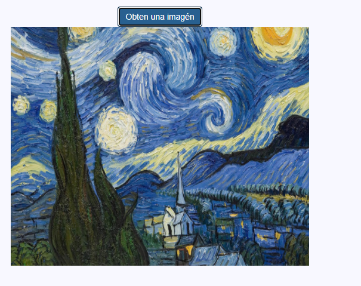

3.  La aplicación presenta el feature hacer click en el botón `Obtener Saludo`,el cual brindara un agradable saludo al nombre especificado.

    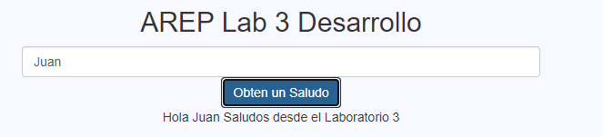
    
    
4.  Para acceder directamente a la dirección get que solicita un servicio de bases de datos se pone la siguiente dirección en la URL.

    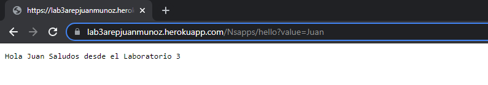
    
5.  El servidor retorna archivos estáticos con las extensiones js,png y html.
      
    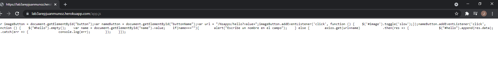
    
    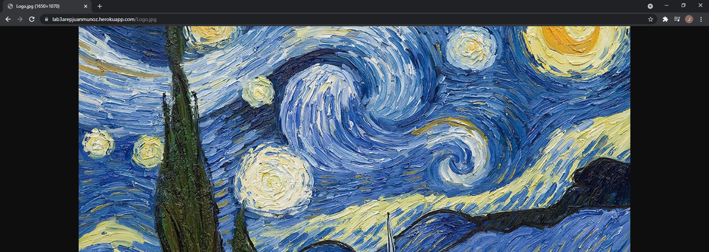
    
    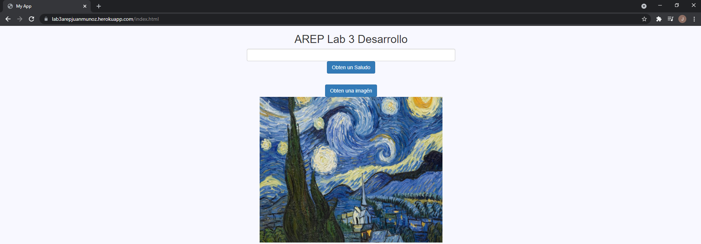
    
6.  En caso de que los archivos objetivos no existan la aplicación mostrara los siguiente:

    

## Diagramas

Se presenta el diagrama de clases de la solución al laboratorio

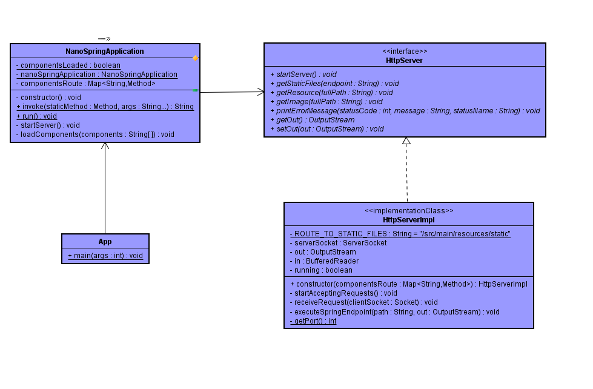

La aplicación tiene tres componentes principales, FrontEnd, BackEnd y FirebaseDB.

A continuación se presente el diagrama de clase del servicio para el laboratorio

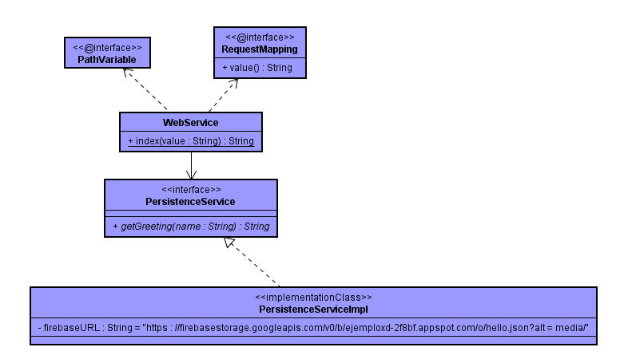

A continuación se presentara el diagrama de componentes que forma parte de la solución.

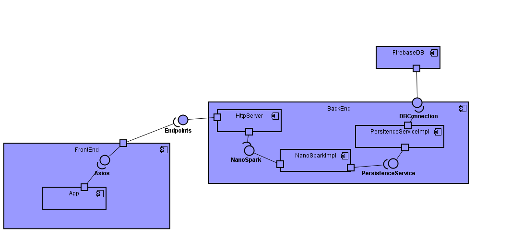

La función lambda con la que se configuró este endpoint permite conectarse al componente **PersistenceServiceImpl**, este se conecta la base de datos Firebase para obtener el saludo que retorna junto con el nombre del usuario.

Por último se presenta el diagrama de arquitectura general que se utilizo para el desarrollo de la solución

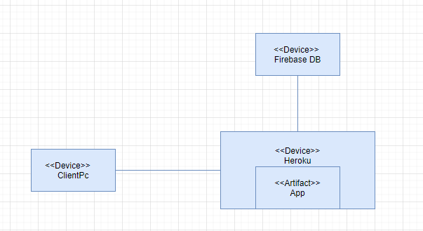

## Documentación en PDF

La documentación se encuentra en el repositorio como un archivo .pdf

## Autor

  - **Juan Sebastián Muñoz Dorado**